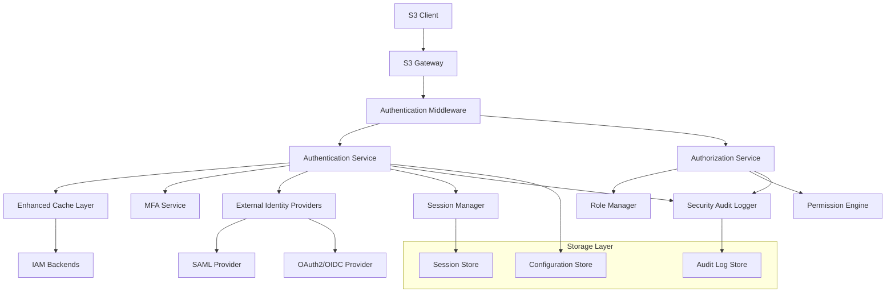

# Дизайн улучшенной системы аутентификации и авторизации

## Обзор

Данный документ описывает архитектурное решение для улучшения существующей системы аутентификации и авторизации в Versity S3 Gateway. Дизайн основан на анализе текущей кодовой базы и направлен на решение выявленных проблем в области безопасности, производительности и функциональности.

Основные цели дизайна:
- Повышение безопасности через MFA и расширенный аудит
- Улучшение производительности через оптимизированное кэширование
- Обеспечение масштабируемости и высокой доступности
- Интеграция с внешними системами идентификации
- Гибкое управление ролями и разрешениями

## Архитектура

### Высокоуровневая архитектура



### Архитектурные принципы

1. **Модульность**: Каждый компонент имеет четко определенную ответственность
2. **Расширяемость**: Легкое добавление новых провайдеров аутентификации
3. **Производительность**: Многоуровневое кэширование и оптимизация запросов
4. **Безопасность**: Принцип "запретить по умолчанию" и комплексный аудит
5. **Отказоустойчивость**: Graceful degradation и fallback механизмы## Ком
поненты и интерфейсы

### 1. Enhanced Cache Layer

**Назначение**: Высокопроизводительное кэширование данных аутентификации с интеллектуальным управлением жизненным циклом.

**Ключевые особенности**:
- LRU eviction policy для управления памятью
- Настраиваемый TTL для разных типов данных
- Автоматическая инвалидация при изменениях
- Fallback механизм при недоступности IAM

```go
type EnhancedCache interface {
    Get(key string, entryType CacheEntryType) (interface{}, bool)
    Set(key string, value interface{}, ttl time.Duration, entryType CacheEntryType)
    Invalidate(pattern string) error
    InvalidateUser(userID string) error
    SetFallbackMode(enabled bool)
    GetStats() CacheStats
}

type CacheEntryType int
const (
    UserCredentials CacheEntryType = iota
    UserRoles
    Permissions
    MFASettings
    SessionData
)
```

**Обоснование дизайна**: Существующий кэш в `auth/iam_cache.go` требует расширения для поддержки различных типов данных с разными TTL и политиками инвалидации.

### 2. MFA Service

**Назначение**: Реализация многофакторной аутентификации с поддержкой TOTP.

```go
type MFAService interface {
    GenerateSecret(userID string) (*MFASecret, error)
    ValidateTOTP(userID, token string) error
    IsMFARequired(userID string) bool
    EnableMFA(userID string, secret *MFASecret) error
    DisableMFA(userID string) error
    GetMFAStatus(userID string) (*MFAStatus, error)
}

type MFASecret struct {
    Secret    string
    QRCode    []byte
    BackupCodes []string
}

type MFAStatus struct {
    Enabled     bool
    LastUsed    time.Time
    BackupCodesRemaining int
}
```

**Обоснование дизайна**: TOTP выбран как наиболее распространенный и безопасный метод MFA. Backup codes обеспечивают восстановление доступа.### 
3. Enhanced Role Manager

**Назначение**: Гибкая система управления ролями с поддержкой наследования и композиции разрешений.

```go
type RoleManager interface {
    CreateRole(role *Role) error
    UpdateRole(roleID string, updates *RoleUpdates) error
    DeleteRole(roleID string) error
    AssignRole(userID, roleID string) error
    RevokeRole(userID, roleID string) error
    GetUserRoles(userID string) ([]*Role, error)
    GetEffectivePermissions(userID string) (*PermissionSet, error)
}

type Role struct {
    ID          string
    Name        string
    Description string
    Permissions []Permission
    ParentRoles []string
    CreatedAt   time.Time
    UpdatedAt   time.Time
}

type Permission struct {
    Resource string
    Action   string
    Effect   PermissionEffect
    Conditions map[string]interface{}
}

type PermissionEffect int
const (
    Allow PermissionEffect = iota
    Deny
)
```

**Обоснование дизайна**: Иерархическая система ролей с явными разрешениями обеспечивает гибкость и безопасность. Принцип "deny by default" минимизирует риски.

### 4. Session Manager

**Назначение**: Безопасное управление пользовательскими сессиями с поддержкой мониторинга и принудительного завершения.

```go
type SessionManager interface {
    CreateSession(userID string, metadata *SessionMetadata) (*Session, error)
    ValidateSession(sessionID string) (*Session, error)
    RefreshSession(sessionID string) error
    TerminateSession(sessionID string) error
    TerminateAllUserSessions(userID string) error
    GetActiveSessions(userID string) ([]*Session, error)
    CleanupExpiredSessions() error
}

type Session struct {
    ID        string
    UserID    string
    CreatedAt time.Time
    ExpiresAt time.Time
    LastUsed  time.Time
    IPAddress string
    UserAgent string
    MFAVerified bool
    Metadata  map[string]interface{}
}
```

**Обоснование дизайна**: Централизованное управление сессиями обеспечивает безопасность и возможность мониторинга активности пользователей.##
# 5. External Identity Providers

**Назначение**: Интеграция с внешними системами аутентификации (SAML, OAuth2, OpenID Connect).

```go
type ExternalProvider interface {
    Authenticate(credentials interface{}) (*ExternalUser, error)
    ValidateToken(token string) (*TokenClaims, error)
    GetProviderInfo() *ProviderInfo
    IsHealthy() bool
}

type SAMLProvider struct {
    Config *SAMLConfig
    // SAML-specific implementation
}

type OAuth2Provider struct {
    Config *OAuth2Config
    // OAuth2-specific implementation
}

type ExternalUser struct {
    ID       string
    Email    string
    Name     string
    Groups   []string
    Attributes map[string]interface{}
}
```

**Обоснование дизайна**: Единый интерфейс для всех внешних провайдеров упрощает интеграцию и обеспечивает консистентность.

### 6. Security Audit Logger

**Назначение**: Комплексное логирование событий безопасности с поддержкой алертов и аналитики.

```go
type SecurityAuditLogger interface {
    LogAuthenticationAttempt(event *AuthEvent) error
    LogAuthorizationCheck(event *AuthzEvent) error
    LogSecurityAlert(alert *SecurityAlert) error
    LogSessionEvent(event *SessionEvent) error
    QueryAuditLogs(query *AuditQuery) ([]*AuditRecord, error)
    GenerateSecurityReport(params *ReportParams) (*SecurityReport, error)
}

type AuthEvent struct {
    UserID    string
    Action    string
    Success   bool
    IPAddress string
    UserAgent string
    MFAUsed   bool
    Provider  string
    Timestamp time.Time
    Details   map[string]interface{}
}

type SecurityAlert struct {
    Type        AlertType
    Severity    AlertSeverity
    UserID      string
    Description string
    Metadata    map[string]interface{}
    Timestamp   time.Time
}
```

**Обоснование дизайна**: Структурированное логирование обеспечивает эффективный анализ и соответствие требованиям аудита.## Моде
ли данных

### User Authentication Data

```go
type AuthenticatedUser struct {
    ID              string
    Username        string
    Email           string
    Roles           []string
    MFAEnabled      bool
    MFASecret       string
    LastLogin       time.Time
    FailedAttempts  int
    LockedUntil     *time.Time
    ExternalProvider string
    ExternalID      string
    Metadata        map[string]interface{}
}
```

### Configuration Models

```go
type AuthConfig struct {
    Cache          CacheConfig
    MFA            MFAConfig
    Session        SessionConfig
    ExternalProviders []ProviderConfig
    Security       SecurityConfig
    Performance    PerformanceConfig
}

type CacheConfig struct {
    DefaultTTL    time.Duration
    MaxSize       int
    EvictionPolicy string
    FallbackEnabled bool
}

type MFAConfig struct {
    Required      bool
    TOTPWindow    int
    BackupCodes   int
    GracePeriod   time.Duration
}
```

## Обработка ошибок

### Стратегия обработки ошибок

1. **Graceful Degradation**: При недоступности внешних сервисов система продолжает работать с ограниченной функциональностью
2. **Fail Secure**: При критических ошибках система блокирует доступ
3. **Detailed Logging**: Все ошибки логируются с контекстом для диагностики
4. **User-Friendly Messages**: Пользователи получают понятные сообщения об ошибках

```go
type AuthError struct {
    Code    ErrorCode
    Message string
    Details map[string]interface{}
    Cause   error
}

type ErrorCode int
const (
    ErrInvalidCredentials ErrorCode = iota
    ErrMFARequired
    ErrMFAInvalid
    ErrAccountLocked
    ErrSessionExpired
    ErrInsufficientPermissions
    ErrExternalProviderUnavailable
    ErrConfigurationError
)
```## Стра
тегия тестирования

### Unit Testing
- Тестирование каждого компонента в изоляции
- Mock-объекты для внешних зависимостей
- Покрытие edge cases и error scenarios

### Integration Testing
- Тестирование взаимодействия между компонентами
- Тестирование с реальными внешними провайдерами
- End-to-end сценарии аутентификации

### Security Testing
- Тестирование на уязвимости (injection, timing attacks)
- Нагрузочное тестирование системы аутентификации
- Тестирование сценариев атак (brute force, session hijacking)

### Performance Testing
- Бенчмарки производительности кэша
- Нагрузочное тестирование с множественными пользователями
- Тестирование масштабируемости

## Миграция и обратная совместимость

### Стратегия миграции

1. **Поэтапное развертывание**: Новые компоненты добавляются постепенно
2. **Feature Flags**: Возможность включения/выключения новых функций
3. **Backward Compatibility**: Существующие API продолжают работать
4. **Data Migration**: Автоматическая миграция существующих данных пользователей

### План миграции

1. Развертывание Enhanced Cache Layer с fallback на существующий кэш
2. Добавление MFA как опциональной функции
3. Постепенное внедрение новой системы ролей
4. Интеграция внешних провайдеров
5. Полное переключение на новую систему

## Мониторинг и метрики

### Ключевые метрики

- **Authentication Metrics**: Успешные/неуспешные попытки, время отклика
- **Cache Metrics**: Hit rate, eviction rate, размер кэша
- **Security Metrics**: Подозрительная активность, заблокированные пользователи
- **Performance Metrics**: Latency, throughput, resource utilization

### Алерты

- Множественные неудачные попытки аутентификации
- Недоступность внешних провайдеров
- Превышение пороговых значений производительности
- Критические ошибки безопасности## Кон
фигурация и развертывание

### Конфигурация

Система поддерживает hot-reload конфигурации без перезапуска сервиса. Конфигурация валидируется при загрузке и изменении.

### Развертывание

- **Containerized Deployment**: Поддержка Docker и Kubernetes
- **High Availability**: Возможность развертывания в кластере
- **Rolling Updates**: Обновления без простоя
- **Health Checks**: Проверки состояния для load balancer'ов

## Безопасность

### Принципы безопасности

1. **Defense in Depth**: Многоуровневая защита
2. **Principle of Least Privilege**: Минимальные необходимые права
3. **Fail Secure**: Безопасное поведение при ошибках
4. **Audit Everything**: Полное логирование событий безопасности

### Защита от атак

- **Brute Force Protection**: Rate limiting и временная блокировка
- **Session Security**: Secure cookies, CSRF protection
- **Input Validation**: Валидация всех входных данных
- **Timing Attack Prevention**: Константное время выполнения критических операций

## Интеграция с существующей системой

### Точки интеграции

1. **Middleware Integration**: Расширение существующего `authentication.go` middleware
2. **IAM Backend Compatibility**: Сохранение совместимости с существующими IAM backends
3. **Configuration Extension**: Расширение существующей конфигурации без breaking changes
4. **Logging Integration**: Использование существующей системы логирования

### Модификации существующего кода

- Расширение `auth/iam.go` интерфейсов для поддержки новых функций
- Обновление `s3api/middlewares/authentication.go` для интеграции MFA
- Расширение `auth/iam_cache.go` с новыми возможностями кэширования
- Интеграция с существующей системой метрик в `metrics/`

Дизайн обеспечивает плавную интеграцию с существующей архитектурой, минимизируя breaking changes и максимизируя переиспользование существующего кода.