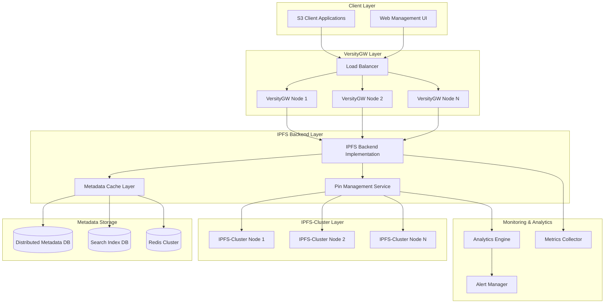

# Проектирование интеграции VersityGW с IPFS-Cluster

## Обзор

Данный документ описывает архитектурное решение для интеграции Versity S3 Gateway с IPFS-Cluster, обеспечивающее масштабируемое хранение и управление триллионом закрепленных объектов. Решение основано на анализе существующей архитектуры VersityGW и требованиях к обработке сверхбольших объемов данных в IPFS.

## Архитектура

### Общая архитектура системы



### Компоненты и интерфейсы

#### 1. IPFS Backend Implementation

Новый backend для VersityGW, реализующий интерфейс `backend.Backend`:

```go
type IPFSBackend struct {
    backend.BackendUnsupported
    
    // Core components
    clusterClient  *cluster.Client
    pinManager     *PinManager
    metadataStore  MetadataStore
    cacheLayer     CacheLayer
    
    // Configuration
    config         *IPFSConfig
    replicationMin int
    replicationMax int
    
    // Performance optimization
    objectCache    *ObjectCache
    pinCache       *PinCache
    workerPool     *WorkerPool
}

type IPFSConfig struct {
    ClusterEndpoints    []string
    MetadataDBType      string
    MetadataDBEndpoints []string
    CacheEndpoints      []string
    MaxConcurrentPins   int
    PinTimeout          time.Duration
    ChunkSize           int64
    CompressionEnabled  bool
}
```

#### 2. Pin Management Service

Сервис для управления pins в масштабе триллиона объектов:

```go
type PinManager struct {
    clusterAPI     cluster.API
    metadataStore  MetadataStore
    replicaManager *ReplicaManager
    
    // Queues for async operations
    pinQueue       chan PinRequest
    unpinQueue     chan UnpinRequest
    
    // Workers
    pinWorkers     []*PinWorker
    unpinWorkers   []*UnpinWorker
    
    // Monitoring
    metrics        *PinMetrics
}

type PinRequest struct {
    CID           string
    S3Key         string
    Bucket        string
    ReplicationFactor int
    Priority      PinPriority
    Metadata      map[string]string
}

type PinWorker struct {
    id            int
    clusterClient *cluster.Client
    requestChan   chan PinRequest
    resultChan    chan PinResult
}
```

#### 3. Metadata Storage Layer

Распределенная система хранения метаданных:

```go
type MetadataStore interface {
    // Object mapping operations
    StoreMapping(s3Key, bucket, cid string, metadata ObjectMetadata) error
    GetMapping(s3Key, bucket string) (*ObjectMapping, error)
    DeleteMapping(s3Key, bucket string) error
    
    // Batch operations for performance
    StoreMappingBatch(mappings []ObjectMapping) error
    GetMappingBatch(keys []S3Key) ([]ObjectMapping, error)
    
    // Search and indexing
    SearchByCID(cid string) ([]ObjectMapping, error)
    SearchByPrefix(bucket, prefix string) ([]ObjectMapping, error)
    
    // Statistics and monitoring
    GetStats() (*MetadataStats, error)
}

type ObjectMapping struct {
    S3Key      string
    Bucket     string
    CID        string
    Size       int64
    CreatedAt  time.Time
    UpdatedAt  time.Time
    Metadata   ObjectMetadata
    PinStatus  PinStatus
}

type ObjectMetadata struct {
    ContentType     string
    ContentEncoding string
    UserMetadata    map[string]string
    Tags           map[string]string
    ACL            string
}
```

#### 4. Cache Layer

Многоуровневая система кэширования:

```go
type CacheLayer struct {
    // L1: In-memory cache (hot data)
    memoryCache   *MemoryCache
    
    // L2: Redis cluster (warm data)
    redisCluster  *RedisCluster
    
    // L3: Distributed cache (cold data)
    distCache     *DistributedCache
    
    // Cache policies
    evictionPolicy EvictionPolicy
    ttlPolicy      TTLPolicy
}

type MemoryCache struct {
    cache     map[string]*CacheEntry
    lru       *LRUList
    mutex     sync.RWMutex
    maxSize   int64
    currentSize int64
}

type CacheEntry struct {
    Key        string
    Value      interface{}
    Size       int64
    AccessTime time.Time
    TTL        time.Duration
}
```

### Модели данных

#### 1. S3 Key to IPFS CID Mapping

```go
type S3ToIPFSMapping struct {
    // Primary key
    S3Key    string `json:"s3_key" db:"s3_key"`
    Bucket   string `json:"bucket" db:"bucket"`
    
    // IPFS data
    CID      string `json:"cid" db:"cid"`
    Size     int64  `json:"size" db:"size"`
    
    // Metadata
    ContentType     string            `json:"content_type" db:"content_type"`
    ContentEncoding string            `json:"content_encoding" db:"content_encoding"`
    UserMetadata    map[string]string `json:"user_metadata" db:"user_metadata"`
    Tags           map[string]string `json:"tags" db:"tags"`
    
    // Pin information
    PinStatus       PinStatus `json:"pin_status" db:"pin_status"`
    ReplicationCount int      `json:"replication_count" db:"replication_count"`
    PinnedNodes     []string  `json:"pinned_nodes" db:"pinned_nodes"`
    
    // Timestamps
    CreatedAt time.Time `json:"created_at" db:"created_at"`
    UpdatedAt time.Time `json:"updated_at" db:"updated_at"`
    AccessedAt time.Time `json:"accessed_at" db:"accessed_at"`
}

type PinStatus int

const (
    PinStatusPending PinStatus = iota
    PinStatusPinned
    PinStatusFailed
    PinStatusUnpinning
    PinStatusUnpinned
)
```

#### 2. Pin Analytics Data

```go
type PinAnalytics struct {
    CID              string    `json:"cid"`
    AccessCount      int64     `json:"access_count"`
    LastAccessTime   time.Time `json:"last_access_time"`
    AverageAccessTime float64   `json:"average_access_time"`
    GeographicAccess map[string]int64 `json:"geographic_access"`
    PeerAccessCount  map[string]int64 `json:"peer_access_count"`
    
    // Performance metrics
    RetrievalLatency []time.Duration `json:"retrieval_latency"`
    TransferSpeed    []float64       `json:"transfer_speed"`
    
    // Replication optimization
    OptimalReplicas  int      `json:"optimal_replicas"`
    CurrentReplicas  int      `json:"current_replicas"`
    RecommendedNodes []string `json:"recommended_nodes"`
}
```

### Обработка ошибок

#### Error Handling Strategy

```go
type IPFSError struct {
    Code      ErrorCode
    Message   string
    CID       string
    S3Key     string
    Bucket    string
    Cause     error
    Timestamp time.Time
}

type ErrorCode int

const (
    ErrIPFSNodeUnavailable ErrorCode = iota
    ErrPinTimeout
    ErrInsufficientReplicas
    ErrMetadataCorruption
    ErrCIDNotFound
    ErrClusterSplit
    ErrStorageQuotaExceeded
)

// Error recovery strategies
type RecoveryStrategy interface {
    CanRecover(err *IPFSError) bool
    Recover(ctx context.Context, err *IPFSError) error
    GetRetryDelay(attempt int) time.Duration
}

type PinRecoveryStrategy struct {
    maxRetries    int
    backoffFactor float64
    maxDelay      time.Duration
}
```

### Стратегия тестирования

#### 1. Unit Testing

```go
// Test interfaces for mocking
type MockClusterClient struct {
    pins map[string]PinInfo
    mu   sync.RWMutex
}

type MockMetadataStore struct {
    mappings map[string]ObjectMapping
    mu       sync.RWMutex
}

// Performance benchmarks
func BenchmarkPinOperation(b *testing.B) {
    backend := setupTestIPFSBackend()
    
    b.ResetTimer()
    for i := 0; i < b.N; i++ {
        err := backend.PinObject(generateTestCID(), generateTestMetadata())
        if err != nil {
            b.Fatal(err)
        }
    }
}

func BenchmarkConcurrentPins(b *testing.B) {
    backend := setupTestIPFSBackend()
    
    b.RunParallel(func(pb *testing.PB) {
        for pb.Next() {
            err := backend.PinObject(generateTestCID(), generateTestMetadata())
            if err != nil {
                b.Fatal(err)
            }
        }
    })
}
```

#### 2. Integration Testing

```go
type IntegrationTestSuite struct {
    ipfsCluster   *testcluster.Cluster
    versityGW     *testgateway.Gateway
    metadataDB    *testdb.Database
    testData      []TestObject
}

func (suite *IntegrationTestSuite) TestTrillionPinsScenario() {
    // Test scenario with simulated trillion pins
    const totalPins = 1_000_000_000_000
    const batchSize = 1_000_000
    
    for batch := 0; batch < totalPins/batchSize; batch++ {
        objects := generateTestObjects(batchSize)
        err := suite.versityGW.PutObjectsBatch(objects)
        assert.NoError(suite.T(), err)
        
        // Verify pins are created
        for _, obj := range objects {
            pinStatus := suite.ipfsCluster.GetPinStatus(obj.CID)
            assert.Equal(suite.T(), cluster.TrackerStatusPinned, pinStatus)
        }
    }
}
```

#### 3. Load Testing

```go
type LoadTestConfig struct {
    ConcurrentUsers    int
    RequestsPerSecond  int
    TestDuration       time.Duration
    ObjectSizeRange    [2]int64
    ReadWriteRatio     float64
}

func RunLoadTest(config LoadTestConfig) (*LoadTestResults, error) {
    // Implement comprehensive load testing
    // - Concurrent S3 operations
    // - Pin/unpin operations
    // - Metadata queries
    // - Cache performance
    // - Cluster failover scenarios
}
```

## Производительность и масштабирование

### Оптимизации производительности

1. **Асинхронная обработка pins**
   - Очереди для pin/unpin операций
   - Worker pools для параллельной обработки
   - Batch операции для метаданных

2. **Многоуровневое кэширование**
   - L1: In-memory cache для горячих данных
   - L2: Redis cluster для теплых данных  
   - L3: Distributed cache для холодных данных

3. **Оптимизация метаданных**
   - Шардирование по bucket/prefix
   - Индексирование для быстрого поиска
   - Компрессия для экономии места

4. **Интеллектуальная репликация**
   - Анализ паттернов доступа
   - Географическое размещение реплик
   - Динамическое изменение количества реплик

### Стратегии масштабирования

1. **Горизонтальное масштабирование**
   - Добавление новых узлов VersityGW
   - Расширение IPFS-Cluster
   - Шардирование метаданных

2. **Вертикальное масштабирование**
   - Увеличение ресурсов узлов
   - Оптимизация конфигурации
   - Тюнинг производительности

## Безопасность

### Модель безопасности

1. **Шифрование данных**
   - Client-side шифрование объектов
   - TLS для передачи данных
   - Шифрование метаданных

2. **Контроль доступа**
   - Интеграция с IAM VersityGW
   - IPFS-specific permissions
   - Audit logging

3. **Защита от атак**
   - Rate limiting
   - DDoS protection
   - Malware scanning

## Мониторинг и наблюдаемость

### Ключевые метрики

1. **Производительность**
   - Latency операций pin/unpin
   - Throughput S3 операций
   - Cache hit ratio

2. **Надежность**
   - Availability узлов кластера
   - Replication health
   - Error rates

3. **Ресурсы**
   - CPU/Memory utilization
   - Network bandwidth
   - Storage usage

### Алерты и уведомления

1. **Критические алерты**
   - Cluster split-brain
   - Massive pin failures
   - Metadata corruption

2. **Предупреждения**
   - High latency
   - Low replication factor
   - Resource exhaustion

Данная архитектура обеспечивает масштабируемую, надежную и производительную интеграцию VersityGW с IPFS-Cluster для обработки триллиона pins с сохранением совместимости с S3 API.