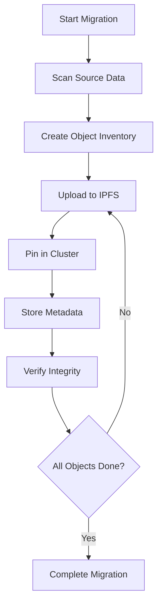

# VersityGW IPFS-Cluster Integration Migration Guide

## Overview

This guide provides comprehensive instructions for migrating to VersityGW with IPFS-Cluster backend integration. Whether you're upgrading from a previous version of VersityGW or migrating from another S3-compatible storage solution, this guide will help ensure a smooth transition.

## Table of Contents

1. [Pre-Migration Planning](#pre-migration-planning)
2. [System Requirements](#system-requirements)
3. [Migration Strategies](#migration-strategies)
4. [Step-by-Step Migration](#step-by-step-migration)
5. [Configuration Migration](#configuration-migration)
6. [Data Migration](#data-migration)
7. [Testing and Validation](#testing-and-validation)
8. [Rollback Procedures](#rollback-procedures)
9. [Post-Migration Optimization](#post-migration-optimization)
10. [Troubleshooting](#troubleshooting)

## Pre-Migration Planning

### Assessment Checklist

Before beginning the migration, complete this assessment:

- [ ] **Current System Inventory**
  - Document current VersityGW version and configuration
  - Inventory all buckets, objects, and total data volume
  - Document current performance baselines
  - List all client applications and their configurations

- [ ] **Infrastructure Requirements**
  - Verify system requirements are met
  - Plan IPFS-Cluster deployment architecture
  - Ensure network connectivity between components
  - Plan for additional storage and compute resources

- [ ] **Migration Timeline**
  - Estimate migration duration based on data volume
  - Plan maintenance windows for minimal business impact
  - Coordinate with stakeholders and client application owners
  - Prepare rollback timeline if needed

- [ ] **Risk Assessment**
  - Identify critical applications and data
  - Plan for potential downtime scenarios
  - Prepare communication plan for users
  - Document rollback criteria and procedures

### Data Volume Estimation

Use these formulas to estimate migration time:

```bash
# Estimate migration time
TOTAL_OBJECTS=$(s3cmd ls -r s3://your-bucket/ | wc -l)
TOTAL_SIZE_GB=$(s3cmd du -H s3://your-bucket/ | awk '{print $1}')
NETWORK_BANDWIDTH_MBPS=1000  # Adjust based on your network

# Estimated time in hours
MIGRATION_TIME_HOURS=$((TOTAL_SIZE_GB * 8 / NETWORK_BANDWIDTH_MBPS / 3600))

echo "Estimated migration time: $MIGRATION_TIME_HOURS hours"
echo "Total objects: $TOTAL_OBJECTS"
echo "Total size: ${TOTAL_SIZE_GB}GB"
```

## System Requirements

### Minimum Requirements

| Component | Minimum | Recommended | Notes |
|-----------|---------|-------------|-------|
| CPU | 4 cores | 8+ cores | More cores improve concurrent operations |
| RAM | 8 GB | 16+ GB | Additional RAM improves caching performance |
| Storage | 100 GB | 500+ GB | For metadata, logs, and temporary files |
| Network | 1 Gbps | 10+ Gbps | Higher bandwidth reduces migration time |

### IPFS-Cluster Requirements

| Node Type | CPU | RAM | Storage | Network |
|-----------|-----|-----|---------|---------|
| IPFS Node | 2 cores | 4 GB | 1+ TB | 1 Gbps |
| Cluster Node | 1 core | 2 GB | 50 GB | 1 Gbps |
| Gateway Node | 4 cores | 8 GB | 100 GB | 10 Gbps |

### Software Dependencies

```bash
# Required software versions
Docker >= 20.10.0
Docker Compose >= 2.0.0
Go >= 1.19 (for building from source)
YDB >= 23.1 (for metadata storage)
Redis >= 7.0 (for caching)
```

## Migration Strategies

### Strategy 1: Blue-Green Migration (Recommended)

**Best for:** Production environments requiring zero downtime

**Process:**
1. Deploy new IPFS-enabled VersityGW in parallel (Green)
2. Migrate data to new system while old system serves traffic (Blue)
3. Switch traffic to new system once migration is complete
4. Keep old system as backup until validation is complete

**Advantages:**
- Zero downtime
- Easy rollback
- Full validation before cutover

**Disadvantages:**
- Requires double the infrastructure
- More complex setup

### Strategy 2: Rolling Migration

**Best for:** Large datasets with acceptable brief downtime

**Process:**
1. Migrate data in batches during maintenance windows
2. Update client configurations progressively
3. Gradually phase out old system

**Advantages:**
- Lower infrastructure requirements
- Gradual transition reduces risk
- Can pause/resume migration

**Disadvantages:**
- Some downtime required
- More complex coordination

### Strategy 3: Big Bang Migration

**Best for:** Small datasets or development environments

**Process:**
1. Schedule maintenance window
2. Stop old system
3. Migrate all data
4. Start new system
5. Update client configurations

**Advantages:**
- Simple process
- Clean cutover
- Lower infrastructure requirements

**Disadvantages:**
- Extended downtime
- Higher risk
- Difficult rollback

## Step-by-Step Migration

### Phase 1: Environment Preparation

#### 1.1 Deploy IPFS-Cluster Infrastructure

```bash
# Clone the repository
git clone https://github.com/versity/versitygw.git
cd versitygw

# Run the production deployment script
sudo ./scripts/deploy-production-ipfs.sh

# Verify cluster is healthy
curl http://localhost:9094/health
```

#### 1.2 Configure Metadata Database

```bash
# Initialize YDB database
docker exec ydb-metadata ydb -e grpc://localhost:2136 -d /local \
  scheme create table versitygw_objects (
    s3_key Utf8,
    bucket Utf8,
    cid Utf8,
    size Uint64,
    created_at Timestamp,
    updated_at Timestamp,
    metadata Json,
    pin_status Uint32,
    PRIMARY KEY (bucket, s3_key)
  )

# Create indexes
docker exec ydb-metadata ydb -e grpc://localhost:2136 -d /local \
  scheme create index idx_cid ON versitygw_objects (cid)
```

#### 1.3 Configure Redis Cluster

```bash
# Initialize Redis cluster
docker exec redis-0 redis-cli --cluster create \
  127.0.0.1:6379 127.0.0.1:6380 127.0.0.1:6381 \
  --cluster-replicas 0 --cluster-yes

# Verify cluster status
docker exec redis-0 redis-cli cluster info
```

### Phase 2: Configuration Migration

#### 2.1 Backup Current Configuration

```bash
# Backup current VersityGW configuration
cp /etc/versitygw/versitygw.conf /etc/versitygw/versitygw.conf.backup.$(date +%Y%m%d)

# Backup IAM configuration
cp -r /etc/versitygw/iam /etc/versitygw/iam.backup.$(date +%Y%m%d)
```

#### 2.2 Convert Configuration Format

Use the provided migration script to convert your configuration:

```bash
# Run configuration migration script
./scripts/migrate-config.sh /etc/versitygw/versitygw.conf /etc/versitygw/versitygw.yaml

# Review the generated configuration
cat /etc/versitygw/versitygw.yaml
```

#### 2.3 Update IAM Configuration

```bash
# Migrate IAM users and policies
./scripts/migrate-iam.sh /etc/versitygw/iam /etc/versitygw/versitygw.yaml

# Verify IAM migration
versitygw --config /etc/versitygw/versitygw.yaml --validate-iam
```

### Phase 3: Data Migration

#### 3.1 Create Migration Plan

```bash
# Generate migration plan
./scripts/create-migration-plan.sh \
  --source-backend posix \
  --source-path /var/lib/versitygw/data \
  --target-backend ipfs \
  --output migration-plan.json

# Review migration plan
cat migration-plan.json
```

#### 3.2 Start Data Migration

```bash
# Start migration process
./scripts/migrate-data.sh \
  --plan migration-plan.json \
  --workers 10 \
  --batch-size 1000 \
  --log-file migration.log

# Monitor migration progress
tail -f migration.log
```

#### 3.3 Monitor Migration Progress

```bash
# Check migration status
./scripts/migration-status.sh --plan migration-plan.json

# Example output:
# Migration Progress:
#   Total Objects: 1,000,000
#   Migrated: 750,000 (75%)
#   Failed: 1,250 (0.125%)
#   Remaining: 248,750
#   ETA: 2h 15m
```

### Phase 4: Validation and Testing

#### 4.1 Data Integrity Verification

```bash
# Verify data integrity
./scripts/verify-migration.sh \
  --source-backend posix \
  --source-path /var/lib/versitygw/data \
  --target-backend ipfs \
  --sample-size 10000

# Check for missing objects
./scripts/find-missing-objects.sh --plan migration-plan.json
```

#### 4.2 Performance Testing

```bash
# Run performance tests
./scripts/performance-test.sh \
  --endpoint https://localhost:8080 \
  --access-key your-access-key \
  --secret-key your-secret-key \
  --duration 300s \
  --concurrent-users 50

# Compare with baseline performance
./scripts/compare-performance.sh baseline.json current.json
```

#### 4.3 Functional Testing

```bash
# Run comprehensive functional tests
go test -v ./backend/ipfs/... -tags=integration

# Test S3 API compatibility
./scripts/s3-compatibility-test.sh https://localhost:8080
```

### Phase 5: Cutover

#### 5.1 Final Synchronization

```bash
# Perform final incremental sync
./scripts/incremental-sync.sh \
  --plan migration-plan.json \
  --since "$(cat last-sync-timestamp.txt)"

# Update timestamp
date -u +"%Y-%m-%dT%H:%M:%SZ" > last-sync-timestamp.txt
```

#### 5.2 Switch Traffic

```bash
# Update load balancer configuration
# (This step depends on your load balancer setup)

# For HAProxy example:
echo "server versitygw-ipfs localhost:8080 check" >> /etc/haproxy/haproxy.cfg
systemctl reload haproxy

# Update DNS if using DNS-based routing
# (Update your DNS records to point to new endpoints)
```

#### 5.3 Update Client Configurations

```bash
# Generate client configuration updates
./scripts/generate-client-configs.sh \
  --old-endpoint https://old.versitygw.com \
  --new-endpoint https://new.versitygw.com \
  --output client-configs/

# Distribute updated configurations to clients
```

## Configuration Migration

### Legacy Configuration Format

```ini
# Old versitygw.conf format
[server]
address = 0.0.0.0:8080
tls_cert = /etc/ssl/certs/server.crt
tls_key = /etc/ssl/private/server.key

[backend]
type = posix
path = /var/lib/versitygw/data

[iam]
type = file
path = /etc/versitygw/iam.json
```

### New YAML Configuration Format

```yaml
# New versitygw.yaml format
server:
  address: "0.0.0.0:8080"
  tls:
    enabled: true
    cert_file: "/etc/ssl/certs/server.crt"
    key_file: "/etc/ssl/private/server.key"

backend:
  type: "ipfs"
  ipfs:
    cluster_endpoints:
      - "http://localhost:9094"
      - "http://localhost:9097"
      - "http://localhost:9100"
    metadata_db:
      type: "ydb"
      endpoints: ["localhost:2136"]
      database: "/local"
    cache:
      enabled: true
      type: "redis_cluster"
      endpoints: ["localhost:6379", "localhost:6380", "localhost:6381"]

iam:
  type: "internal"
  admin_user: "admin"
  admin_password_hash: "$2a$10$..."
```

### Configuration Mapping

| Legacy Setting | New Setting | Notes |
|----------------|-------------|-------|
| `[server] address` | `server.address` | Direct mapping |
| `[server] tls_cert` | `server.tls.cert_file` | Moved under tls section |
| `[server] tls_key` | `server.tls.key_file` | Moved under tls section |
| `[backend] type` | `backend.type` | Change from "posix" to "ipfs" |
| `[backend] path` | N/A | No longer needed for IPFS |
| `[iam] type` | `iam.type` | May need to change based on setup |

## Data Migration

### Migration Process Flow



### Batch Processing

The migration tool processes objects in batches for optimal performance:

```bash
# Configure batch processing
export MIGRATION_BATCH_SIZE=1000      # Objects per batch
export MIGRATION_WORKERS=10           # Concurrent workers
export MIGRATION_RETRY_ATTEMPTS=3     # Retry failed operations
export MIGRATION_RETRY_DELAY=5s       # Delay between retries
```

### Handling Large Objects

For objects larger than 100MB, the migration tool automatically uses multipart upload:

```bash
# Configure multipart upload
export MULTIPART_THRESHOLD=104857600   # 100MB
export MULTIPART_CHUNK_SIZE=67108864   # 64MB chunks
export MULTIPART_CONCURRENCY=5         # Concurrent parts
```

### Error Handling

The migration tool provides comprehensive error handling:

```bash
# View migration errors
./scripts/migration-errors.sh --plan migration-plan.json

# Retry failed objects
./scripts/retry-failed.sh --plan migration-plan.json --max-attempts 5

# Skip problematic objects (use with caution)
./scripts/skip-objects.sh --plan migration-plan.json --object-list failed-objects.txt
```

## Testing and Validation

### Pre-Migration Testing

```bash
# Test IPFS cluster connectivity
./scripts/test-cluster-connectivity.sh

# Test metadata database
./scripts/test-metadata-db.sh

# Test cache connectivity
./scripts/test-cache-connectivity.sh

# Run configuration validation
versitygw --config /etc/versitygw/versitygw.yaml --validate-config
```

### During Migration Testing

```bash
# Monitor migration health
./scripts/monitor-migration.sh --plan migration-plan.json --interval 60s

# Test migrated objects
./scripts/test-migrated-objects.sh --sample-size 1000

# Performance monitoring
./scripts/monitor-performance.sh --duration 3600s
```

### Post-Migration Validation

```bash
# Complete data integrity check
./scripts/full-integrity-check.sh

# Performance benchmark
./scripts/benchmark-performance.sh --duration 1800s

# S3 API compatibility test
./scripts/s3-compatibility-test.sh

# Load test
./scripts/load-test.sh --users 100 --duration 3600s
```

### Validation Checklist

- [ ] **Data Integrity**
  - [ ] All objects successfully migrated
  - [ ] Object checksums match
  - [ ] Metadata preserved correctly
  - [ ] No data corruption detected

- [ ] **Functionality**
  - [ ] All S3 API operations work
  - [ ] Multipart uploads function correctly
  - [ ] Object listing works properly
  - [ ] Access controls enforced

- [ ] **Performance**
  - [ ] Response times within acceptable limits
  - [ ] Throughput meets requirements
  - [ ] No memory leaks detected
  - [ ] Resource utilization normal

- [ ] **Security**
  - [ ] Authentication working
  - [ ] Authorization enforced
  - [ ] Audit logging functional
  - [ ] Encryption working properly

## Rollback Procedures

### Preparation for Rollback

Before starting migration, prepare rollback procedures:

```bash
# Create rollback plan
./scripts/create-rollback-plan.sh \
  --backup-location /backup/versitygw \
  --config-backup /etc/versitygw/versitygw.conf.backup \
  --output rollback-plan.json
```

### Rollback Triggers

Consider rollback if:
- Data integrity issues detected
- Performance significantly degraded
- Critical functionality broken
- Security vulnerabilities discovered
- Client applications failing

### Rollback Process

#### Quick Rollback (Blue-Green Deployment)

```bash
# Switch traffic back to old system
./scripts/switch-traffic.sh --target old-system

# Verify old system is working
./scripts/health-check.sh --endpoint https://old.versitygw.com

# Update client configurations
./scripts/update-client-configs.sh --endpoint https://old.versitygw.com
```

#### Full Rollback

```bash
# Stop new VersityGW service
systemctl stop versitygw

# Restore old configuration
cp /etc/versitygw/versitygw.conf.backup /etc/versitygw/versitygw.conf

# Restore old binary if needed
cp /usr/local/bin/versitygw.backup /usr/local/bin/versitygw

# Start old service
systemctl start versitygw-old

# Verify service is working
curl -k https://localhost:8080/health
```

### Data Rollback

If data needs to be rolled back:

```bash
# Stop all services
systemctl stop versitygw

# Restore data from backup
rsync -av /backup/versitygw/data/ /var/lib/versitygw/data/

# Restore metadata
./scripts/restore-metadata.sh --backup-file /backup/versitygw/metadata.sql

# Start services
systemctl start versitygw
```

## Post-Migration Optimization

### Performance Tuning

#### IPFS Configuration Optimization

```bash
# Optimize IPFS configuration for your workload
./scripts/optimize-ipfs-config.sh \
  --workload-type high-throughput \
  --object-size-avg 1MB \
  --concurrent-users 1000

# Apply optimizations
./scripts/apply-ipfs-optimizations.sh
```

#### Cluster Rebalancing

```bash
# Analyze cluster balance
./scripts/analyze-cluster-balance.sh

# Rebalance pins across nodes
./scripts/rebalance-cluster.sh --strategy geographic

# Monitor rebalancing progress
./scripts/monitor-rebalancing.sh
```

#### Cache Optimization

```bash
# Analyze cache performance
./scripts/analyze-cache-performance.sh --duration 24h

# Optimize cache configuration
./scripts/optimize-cache.sh --hit-ratio-target 0.95

# Warm cache with popular objects
./scripts/warm-cache.sh --top-objects 10000
```

### Monitoring Setup

#### Metrics Collection

```bash
# Configure Prometheus scraping
cat >> /etc/prometheus/prometheus.yml << EOF
  - job_name: 'versitygw-ipfs'
    static_configs:
      - targets: ['localhost:8080']
    metrics_path: '/metrics'
    scrape_interval: 15s
EOF

# Restart Prometheus
systemctl restart prometheus
```

#### Alerting Rules

```bash
# Create alerting rules
cat > /etc/prometheus/versitygw-alerts.yml << EOF
groups:
  - name: versitygw-ipfs
    rules:
      - alert: HighPinLatency
        expr: histogram_quantile(0.95, ipfs_pin_duration_seconds) > 1
        for: 5m
        labels:
          severity: warning
        annotations:
          summary: "High pin latency detected"
          
      - alert: ClusterNodeDown
        expr: up{job="ipfs-cluster"} == 0
        for: 1m
        labels:
          severity: critical
        annotations:
          summary: "IPFS cluster node is down"
EOF

# Reload Prometheus configuration
curl -X POST http://localhost:9090/-/reload
```

#### Dashboard Setup

```bash
# Import Grafana dashboards
./scripts/import-grafana-dashboards.sh \
  --grafana-url http://localhost:3000 \
  --admin-password admin

# Configure data sources
./scripts/configure-grafana-datasources.sh \
  --prometheus-url http://localhost:9090
```

### Security Hardening

#### SSL/TLS Configuration

```bash
# Generate production SSL certificates
./scripts/generate-production-certs.sh \
  --domain versitygw.example.com \
  --ca-cert /path/to/ca.crt \
  --ca-key /path/to/ca.key

# Update configuration with new certificates
./scripts/update-ssl-config.sh \
  --cert-file /etc/ssl/certs/versitygw.crt \
  --key-file /etc/ssl/private/versitygw.key
```

#### Access Control Hardening

```bash
# Review and tighten access controls
./scripts/audit-access-controls.sh

# Implement IP whitelisting
./scripts/configure-ip-whitelist.sh \
  --allowed-ips "10.0.0.0/8,192.168.0.0/16"

# Enable rate limiting
./scripts/configure-rate-limiting.sh \
  --requests-per-second 1000 \
  --burst-size 2000
```

## Troubleshooting

### Common Issues

#### Migration Stuck or Slow

**Symptoms:**
- Migration progress not advancing
- High CPU or memory usage
- Network timeouts

**Solutions:**
```bash
# Check system resources
top
df -h
netstat -an | grep ESTABLISHED | wc -l

# Reduce concurrent workers
export MIGRATION_WORKERS=5

# Increase timeouts
export MIGRATION_TIMEOUT=300s

# Check network connectivity
./scripts/test-network-connectivity.sh
```

#### Objects Failing to Migrate

**Symptoms:**
- High failure rate in migration logs
- Specific objects consistently failing
- Error messages in logs

**Solutions:**
```bash
# Check failed objects
./scripts/analyze-failed-objects.sh --plan migration-plan.json

# Common fixes:
# 1. Increase retry attempts
export MIGRATION_RETRY_ATTEMPTS=5

# 2. Skip corrupted objects (investigate separately)
./scripts/skip-corrupted-objects.sh --plan migration-plan.json

# 3. Check IPFS cluster health
curl http://localhost:9094/health
```

#### Performance Issues After Migration

**Symptoms:**
- Slow response times
- High latency
- Timeouts

**Solutions:**
```bash
# Check cluster performance
./scripts/diagnose-performance.sh

# Common fixes:
# 1. Optimize cache configuration
./scripts/optimize-cache.sh

# 2. Rebalance cluster
./scripts/rebalance-cluster.sh

# 3. Scale cluster if needed
./scripts/scale-cluster.sh --add-nodes 2
```

#### Metadata Inconsistencies

**Symptoms:**
- Objects not found despite being in IPFS
- Incorrect object metadata
- Listing operations failing

**Solutions:**
```bash
# Rebuild metadata index
./scripts/rebuild-metadata-index.sh

# Verify metadata consistency
./scripts/verify-metadata-consistency.sh

# Fix inconsistencies
./scripts/fix-metadata-inconsistencies.sh --auto-fix
```

### Diagnostic Tools

#### Log Analysis

```bash
# Analyze migration logs
./scripts/analyze-migration-logs.sh migration.log

# Check VersityGW logs
journalctl -u versitygw -f --since "1 hour ago"

# Check IPFS cluster logs
docker logs ipfs-cluster-0 --since 1h
```

#### Health Checks

```bash
# Comprehensive health check
./scripts/comprehensive-health-check.sh

# Component-specific checks
./scripts/check-ipfs-health.sh
./scripts/check-metadata-db-health.sh
./scripts/check-cache-health.sh
```

#### Performance Monitoring

```bash
# Real-time performance monitoring
./scripts/monitor-performance-realtime.sh

# Generate performance report
./scripts/generate-performance-report.sh --duration 24h
```

### Getting Help

#### Support Channels

- **Documentation**: [docs.versity.io](https://docs.versity.io)
- **Community Forum**: [community.versity.io](https://community.versity.io)
- **GitHub Issues**: [github.com/versity/versitygw/issues](https://github.com/versity/versitygw/issues)
- **Enterprise Support**: [support@versity.io](mailto:support@versity.io)

#### Information to Provide

When seeking help, please provide:

1. **System Information**
   ```bash
   ./scripts/collect-system-info.sh > system-info.txt
   ```

2. **Configuration Files**
   ```bash
   # Sanitize and collect configuration
   ./scripts/sanitize-config.sh /etc/versitygw/versitygw.yaml > config-sanitized.yaml
   ```

3. **Log Files**
   ```bash
   # Collect relevant logs
   ./scripts/collect-logs.sh --since "24 hours ago" > logs.tar.gz
   ```

4. **Migration Plan and Status**
   ```bash
   # Export migration information
   ./scripts/export-migration-info.sh --plan migration-plan.json > migration-info.json
   ```

---

This migration guide provides comprehensive instructions for migrating to VersityGW with IPFS-Cluster integration. For additional assistance or specific questions about your migration scenario, please contact our support team.