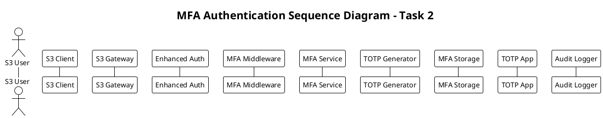

# Подробное объяснение Sequence Diagram Task 2 - MFA Authentication Flow

## Назначение диаграммы

Sequence Diagram для Task 2 показывает временной поток взаимодействий между компонентами MFA Enhanced S3 Gateway системы при обработке различных сценариев многофакторной аутентификации. Эта диаграмма служит мостом между статической архитектурой и динамическим поведением MFA системы.

## Структура PlantUML и поток выполнения

### Заголовок и участники


**Архитектурное значение:**
- Показывает полный жизненный цикл MFA операций
- Демонстрирует взаимодействие между всеми компонентами MFA
- Выявляет точки безопасности и оптимизации

## MFA Setup Phase (Фаза настройки MFA)

### 1. Инициация настройки MFA
```plantuml
== MFA Setup Phase ==
User -> Client: Request MFA setup
Client -> Gateway: POST /mfa/setup
Gateway -> Auth: Authenticate user (V4 signature)
Auth -> Gateway: User authenticated
```

**Реализация на уровне кода:**
```go
// HTTP handler для настройки MFA
func (s *S3APIServer) handleMFASetup(c *fiber.Ctx) error {
    // Получение аутентифицированного пользователя
    account := c.Locals("account").(*Account)
    
    // Проверка что MFA еще не настроен
    status, err := s.mfaService.GetMFAStatus(account.UserID)
    if err == nil && status.Enabled {
        return c.Status(400).JSON(fiber.Map{
            "error": "MFA already enabled for user",
            "code":  "MFA_ALREADY_ENABLED",
        })
    }
    
    // Генерация секрета MFA
    secret, err := s.mfaService.GenerateSecret(account.UserID)
    if err != nil {
        s.auditLogger.LogMFAEvent(c.Context(), "mfa_setup_failed", account.UserID, map[string]interface{}{
            "error": err.Error(),
        })
        return c.Status(500).JSON(fiber.Map{
            "error": "Failed to generate MFA secret",
            "code":  "MFA_SETUP_FAILED",
        })
    }
    
    // Логирование успешной инициации настройки
    s.auditLogger.LogMFAEvent(c.Context(), "mfa_setup_initiated", account.UserID, map[string]interface{}{
        "account_name":       secret.AccountName,
        "backup_codes_count": len(secret.BackupCodes),
        "expires_at":         secret.ExpiresAt,
    })
    
    return c.JSON(fiber.Map{
        "secret":       secret.Secret,
        "qr_code":      secret.QRCode,
        "backup_codes": secret.BackupCodes,
        "issuer":       secret.Issuer,
        "account_name": secret.AccountName,
        "expires_at":   secret.ExpiresAt,
        "setup_instructions": map[string]interface{}{
            "step1": "Scan the QR code with your authenticator app",
            "step2": "Enter the 6-digit code from your app to confirm setup",
            "step3": "Save the backup codes in a secure location",
        },
    })
}
```

### 2. Генерация секрета и QR кода
```plantuml
Gateway -> MFAService: GenerateSecret(userID)
MFAService -> TOTP: GenerateSecret()
TOTP -> MFAService: Return base32 secret
MFAService -> MFAService: Generate backup codes
MFAService -> Gateway: Return MFASecret with QR code
```

**Реализация генерации секрета:**
```go
// service/mfa_service_impl.go - генерация секрета MFA
func (ms *MFAServiceImpl) GenerateSecret(userID string) (*MFASecret, error) {
    // Генерация TOTP секрета
    secret, err := ms.totpGenerator.GenerateSecret()
    if err != nil {
        return nil, fmt.Errorf("failed to generate TOTP secret: %w", err)
    }
    
    // Генерация backup кодов
    backupCodes, err := ms.backupManager.GenerateBackupCodes(ms.config.BackupCodes.Count)
    if err != nil {
        return nil, fmt.Errorf("failed to generate backup codes: %w", err)
    }
    
    // Создание имени аккаунта для TOTP приложения
    accountName := fmt.Sprintf("%s@%s", userID, ms.config.Issuer)
    
    // Генерация QR кода
    totpURI := ms.totpGenerator.GenerateTOTPURI(secret, accountName)
    qrCode, err := ms.qrGenerator.GenerateQRCode(totpURI)
    if err != nil {
        return nil, fmt.Errorf("failed to generate QR code: %w", err)
    }
    
    // Шифрование секрета для хранения
    encryptedSecret, err := ms.encryptor.Encrypt(secret)
    if err != nil {
        return nil, fmt.Errorf("failed to encrypt secret: %w", err)
    }
    
    // Хэширование backup кодов
    hashedBackupCodes := ms.backupManager.HashBackupCodes(backupCodes)
    
    // Создание временных данных пользователя (не активированных)
    userData := &MFAUserData{
        UserID:      userID,
        Secret:      encryptedSecret,
        BackupCodes: hashedBackupCodes,
        Enabled:     false, // Будет активирован после подтверждения
        CreatedAt:   time.Now(),
        UpdatedAt:   time.Now(),
        SetupMethod: "qr_code",
        Version:     1,
    }
    
    // Сохранение временных данных
    if err := ms.storage.StoreMFAData(userID, userData); err != nil {
        return nil, fmt.Errorf("failed to store MFA data: %w", err)
    }
    
    return &MFASecret{
        Secret:      secret, // Возвращаем незашифрованный для настройки
        QRCode:      qrCode,
        BackupCodes: backupCodes, // Возвращаем незахэшированные для показа
        Issuer:      ms.config.Issuer,
        AccountName: accountName,
        GeneratedAt: time.Now(),
        ExpiresAt:   time.Now().Add(ms.config.SetupTimeout),
    }, nil
}

// components/totp_generator.go - генерация TOTP секрета
func (tg *TOTPGenerator) GenerateSecret() (string, error) {
    // Генерация криптографически стойкого случайного секрета
    secret := make([]byte, tg.config.SecretLength) // 20 байт = 160 бит
    if _, err := rand.Read(secret); err != nil {
        return "", fmt.Errorf("failed to generate random secret: %w", err)
    }
    
    // Кодирование в Base32 без padding для совместимости с TOTP приложениями
    encoded := base32.StdEncoding.WithPadding(base32.NoPadding).EncodeToString(secret)
    
    return encoded, nil
}

// components/backup_code_manager.go - генерация backup кодов
func (bcm *BackupCodeManager) GenerateBackupCodes(count int) ([]string, error) {
    codes := make([]string, count)
    
    for i := 0; i < count; i++ {
        // Генерация 8-значного кода
        code := make([]byte, 4)
        if _, err := rand.Read(code); err != nil {
            return nil, fmt.Errorf("failed to generate backup code: %w", err)
        }
        
        // Конвертация в 8-значное число
        codeNum := binary.BigEndian.Uint32(code) % 100000000
        codes[i] = fmt.Sprintf("%08d", codeNum)
    }
    
    return codes, nil
}
```

### 3. Настройка в TOTP приложении
```plantuml
Gateway -> Client: Return setup data (secret, QR, backup codes)
Client -> User: Display QR code and backup codes
User -> TOTPApp: Scan QR code
TOTPApp -> TOTPApp: Store secret and generate tokens
```

**Клиентская реализация:**
```go
// client/mfa_setup.go - клиентская логика настройки MFA
type MFASetupResponse struct {
    Secret      string    `json:"secret"`
    QRCode      string    `json:"qr_code"`
    BackupCodes []string  `json:"backup_codes"`
    Issuer      string    `json:"issuer"`
    AccountName string    `json:"account_name"`
    ExpiresAt   time.Time `json:"expires_at"`
}

func (client *S3Client) SetupMFA() (*MFASetupResponse, error) {
    req, err := http.NewRequest("POST", client.baseURL+"/mfa/setup", nil)
    if err != nil {
        return nil, err
    }
    
    // Добавление AWS Signature V4
    if err := client.signRequest(req); err != nil {
        return nil, fmt.Errorf("failed to sign request: %w", err)
    }
    
    resp, err := client.httpClient.Do(req)
    if err != nil {
        return nil, err
    }
    defer resp.Body.Close()
    
    if resp.StatusCode != 200 {
        return nil, fmt.Errorf("MFA setup failed with status %d", resp.StatusCode)
    }
    
    var setupResp MFASetupResponse
    if err := json.NewDecoder(resp.Body).Decode(&setupResp); err != nil {
        return nil, err
    }
    
    return &setupResp, nil
}

// Отображение QR кода пользователю (псевдокод для CLI)
func displayMFASetup(setup *MFASetupResponse) {
    fmt.Println("MFA Setup Instructions:")
    fmt.Println("1. Install a TOTP authenticator app (Google Authenticator, Authy, etc.)")
    fmt.Println("2. Scan this QR code with your app:")
    
    // Декодирование и отображение QR кода в терминале
    qrData, _ := base64.StdEncoding.DecodeString(setup.QRCode)
    displayQRInTerminal(qrData)
    
    fmt.Printf("3. Or manually enter this secret: %s\n", setup.Secret)
    fmt.Printf("4. Account name: %s\n", setup.AccountName)
    fmt.Printf("5. Issuer: %s\n", setup.Issuer)
    
    fmt.Println("\nBackup Codes (save these in a secure location):")
    for i, code := range setup.BackupCodes {
        fmt.Printf("  %d. %s\n", i+1, code)
    }
    
    fmt.Printf("\nSetup expires at: %s\n", setup.ExpiresAt.Format(time.RFC3339))
    fmt.Println("\nAfter scanning, enter the 6-digit code from your app to complete setup.")
}
```

### 4. Подтверждение настройки
```plantuml
User -> Client: Confirm setup with TOTP token
Client -> Gateway: POST /mfa/enable with token
Gateway -> MFAService: ValidateTOTP(userID, token)
MFAService -> TOTP: ValidateTOTP(secret, token, timestamp)
TOTP -> MFAService: Token valid
MFAService -> Storage: StoreMFAData(userID, mfaData)
Storage -> MFAService: Data stored
MFAService -> Gateway: MFA enabled successfully
Gateway -> Logger: Log MFA setup completion
Gateway -> Client: MFA setup complete
```

**Реализация подтверждения настройки:**
```go
// HTTP handler для активации MFA
func (s *S3APIServer) handleMFAEnable(c *fiber.Ctx) error {
    account := c.Locals("account").(*Account)
    
    // Извлечение TOTP токена из запроса
    var request struct {
        Token string `json:"token" validate:"required,len=6,numeric"`
    }
    
    if err := c.BodyParser(&request); err != nil {
        return c.Status(400).JSON(fiber.Map{
            "error": "Invalid request format",
            "code":  "INVALID_REQUEST",
        })
    }
    
    // Валидация токена и активация MFA
    if err := s.mfaService.EnableMFA(account.UserID, request.Token); err != nil {
        var mfaErr *MFAError
        if errors.As(err, &mfaErr) {
            switch mfaErr.Code {
            case MFAErrorInvalidToken:
                return c.Status(400).JSON(fiber.Map{
                    "error": "Invalid TOTP token",
                    "code":  "INVALID_TOKEN",
                })
            case MFAErrorAlreadyEnabled:
                return c.Status(400).JSON(fiber.Map{
                    "error": "MFA already enabled",
                    "code":  "ALREADY_ENABLED",
                })
            case MFAErrorNotSetup:
                return c.Status(400).JSON(fiber.Map{
                    "error": "MFA not set up. Call /mfa/setup first",
                    "code":  "NOT_SETUP",
                })
            }
        }
        
        s.auditLogger.LogMFAEvent(c.Context(), "mfa_enable_failed", account.UserID, map[string]interface{}{
            "error": err.Error(),
        })
        
        return c.Status(500).JSON(fiber.Map{
            "error": "Failed to enable MFA",
            "code":  "ENABLE_FAILED",
        })
    }
    
    // Получение статуса для возврата
    status, err := s.mfaService.GetMFAStatus(account.UserID)
    if err != nil {
        return c.Status(500).JSON(fiber.Map{"error": "Failed to get MFA status"})
    }
    
    return c.JSON(fiber.Map{
        "message": "MFA enabled successfully",
        "status":  status,
    })
}

// service/mfa_service_impl.go - активация MFA
func (ms *MFAServiceImpl) EnableMFA(userID, token string) error {
    ms.mutex.Lock()
    defer ms.mutex.Unlock()
    
    // Получение временных данных MFA
    userData, err := ms.storage.GetMFAData(userID)
    if err != nil {
        return &MFAError{
            Code:    MFAErrorNotSetup,
            Message: "MFA not set up for user",
            UserID:  userID,
        }
    }
    
    if userData.Enabled {
        return &MFAError{
            Code:    MFAErrorAlreadyEnabled,
            Message: "MFA already enabled for user",
            UserID:  userID,
        }
    }
    
    // Расшифровка секрета
    decryptedSecret, err := ms.encryptor.Decrypt(userData.Secret)
    if err != nil {
        return fmt.Errorf("failed to decrypt secret: %w", err)
    }
    
    // Валидация предоставленного токена
    if err := ms.totpGenerator.ValidateTOTP(decryptedSecret, token, time.Now()); err != nil {
        ms.auditLogger.LogMFAEvent(context.Background(), "mfa_enable_failed", userID, map[string]interface{}{
            "reason": "invalid_token",
        })
        
        return &MFAError{
            Code:    MFAErrorInvalidToken,
            Message: "Invalid TOTP token provided",
            UserID:  userID,
        }
    }
    
    // Активация MFA
    userData.Enabled = true
    enabledAt := time.Now()
    userData.EnabledAt = &enabledAt
    userData.UpdatedAt = time.Now()
    
    // Сохранение активированных данных
    if err := ms.storage.StoreMFAData(userID, userData); err != nil {
        return fmt.Errorf("failed to enable MFA: %w", err)
    }
    
    // Логирование успешной активации
    ms.auditLogger.LogMFAEvent(context.Background(), "mfa_enabled", userID, map[string]interface{}{
        "enabled_at":           userData.EnabledAt,
        "backup_codes_count":   len(userData.BackupCodes),
        "setup_method":         userData.SetupMethod,
    })
    
    ms.metrics.MFAEnabled.Inc()
    return nil
}
```

## MFA Authentication Phase (Фаза аутентификации MFA)

### 1. Генерация TOTP токена
```plantuml
== MFA Authentication Phase ==
User -> TOTPApp: Generate current TOTP token
TOTPApp -> User: Display 6-digit token
```

**TOTP приложение генерирует токен:**
```go
// Псевдокод для TOTP приложения
func generateCurrentTOTP(secret string) string {
    // Текущее время Unix
    currentTime := time.Now().Unix()
    
    // 30-секундные интервалы
    timeStep := currentTime / 30
    
    // Генерация HMAC-SHA1
    key, _ := base32.StdEncoding.WithPadding(base32.NoPadding).DecodeString(secret)
    h := hmac.New(sha1.New, key)
    binary.Write(h, binary.BigEndian, uint64(timeStep))
    hash := h.Sum(nil)
    
    // Динамическое усечение
    offset := hash[19] & 0x0F
    code := binary.BigEndian.Uint32(hash[offset:offset+4]) & 0x7FFFFFFF
    
    // 6-значный код
    return fmt.Sprintf("%06d", code%1000000)
}
```

### 2. S3 запрос с MFA токеном
```plantuml
User -> Client: Make S3 request with MFA token
Client -> Gateway: S3 API request with X-Amz-MFA header
Gateway -> Auth: Authenticate request
Auth -> Auth: Validate V4 signature
Auth -> Auth: Check if MFA required
Auth -> MFAMw: Extract MFA token from request
```

**Реализация S3 клиента с MFA:**
```go
// client/s3_client_mfa.go - S3 клиент с поддержкой MFA
type MFAEnabledS3Client struct {
    *s3.Client
    mfaTokenProvider MFATokenProvider
}

type MFATokenProvider interface {
    GetCurrentMFAToken() (string, error)
}

// Реализация провайдера TOTP токенов
type TOTPTokenProvider struct {
    secret string
}

func (ttp *TOTPTokenProvider) GetCurrentMFAToken() (string, error) {
    return generateCurrentTOTP(ttp.secret), nil
}

// Модификация S3 запросов для включения MFA токена
func (client *MFAEnabledS3Client) GetObject(ctx context.Context, params *s3.GetObjectInput, optFns ...func(*s3.Options)) (*s3.GetObjectOutput, error) {
    // Получение текущего MFA токена
    mfaToken, err := client.mfaTokenProvider.GetCurrentMFAToken()
    if err != nil {
        return nil, fmt.Errorf("failed to get MFA token: %w", err)
    }
    
    // Добавление MFA токена в заголовки
    optFns = append(optFns, func(o *s3.Options) {
        o.APIOptions = append(o.APIOptions, func(stack *middleware.Stack) error {
            return stack.Finalize.Add(
                middleware.FinalizeMiddlewareFunc("AddMFAToken", func(
                    ctx context.Context, in middleware.FinalizeInput, next middleware.FinalizeHandler,
                ) (middleware.FinalizeOutput, middleware.Metadata, error) {
                    req := in.Request.(*smithyhttp.Request)
                    req.Header.Set("X-Amz-MFA", mfaToken)
                    return next.HandleFinalize(ctx, in)
                }),
                middleware.After,
            )
        })
    })
    
    return client.Client.GetObject(ctx, params, optFns...)
}
```

Sequence Diagram Task 2 обеспечивает полное понимание динамического поведения MFA Enhanced S3 Gateway системы и служит руководством для реализации всех сценариев многофакторной аутентификации, показывая как архитектурные компоненты взаимодействуют в runtime.