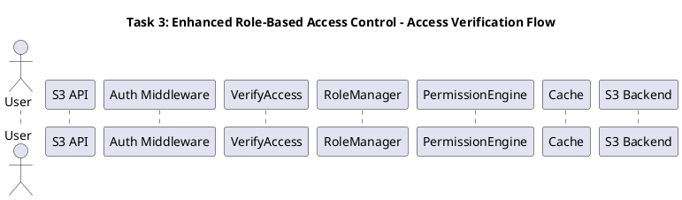

# Подробное объяснение Sequence Diagram Task 3 - Enhanced RBAC System

## Назначение диаграммы

Sequence Diagram для Task 3 показывает временной поток взаимодействий между компонентами Enhanced RBAC системы при обработке запроса доступа к S3 ресурсу. Эта диаграмма служит мостом между статической архитектурой и динамическим поведением системы, демонстрируя как архитектурные решения реализуются в runtime.

## Структура PlantUML и поток выполнения

### Заголовок и участники


**Архитектурное значение:**
- Показывает полный жизненный цикл запроса доступа
- Демонстрирует взаимодействие между всеми компонентами RBAC
- Выявляет точки оптимизации производительности

## Основной поток выполнения

### 1. Инициация запроса пользователем
```plantuml
User -> API: S3 Request (GET /bucket/object)
activate API
```

**Реализация на уровне кода:**
```go
// HTTP клиент отправляет S3 запрос
func (client *S3Client) GetObject(bucket, object string) (*S3Object, error) {
    req, err := http.NewRequest("GET", fmt.Sprintf("/%s/%s", bucket, object), nil)
    if err != nil {
        return nil, err
    }
    
    // Добавление AWS Signature V4
    if err := client.signRequest(req); err != nil {
        return nil, fmt.Errorf("failed to sign request: %w", err)
    }
    
    resp, err := client.httpClient.Do(req)
    if err != nil {
        return nil, err
    }
    defer resp.Body.Close()
    
    if resp.StatusCode == 403 {
        return nil, ErrAccessDenied
    }
    
    return parseS3Object(resp)
}

// Сервер получает запрос
func (s *S3APIServer) handleGetObject(c *fiber.Ctx) error {
    bucket := c.Params("bucket")
    object := c.Params("object")
    
    // Логирование входящего запроса
    log.Printf("Received GET request for %s/%s from %s", 
        bucket, object, c.IP())
    
    // Запрос будет обработан middleware
    return c.Next()
}
```

### 2. Обработка в Auth Middleware
```plantuml
API -> Middleware: Process Request
activate Middleware
```

**Реализация middleware:**
```go
// middleware/auth.go - обработка аутентификации
func (am *AuthMiddleware) Handler() fiber.Handler {
    return func(c *fiber.Ctx) error {
        startTime := time.Now()
        
        // Извлечение информации о пользователе из запроса
        account, err := am.extractAccountFromRequest(c)
        if err != nil {
            am.recordMetric("auth_extraction_failed", time.Since(startTime))
            return c.Status(401).JSON(fiber.Map{
                "error": "Authentication required",
                "code":  "AUTHENTICATION_REQUIRED",
            })
        }
        
        // Создание AccessOptions
        opts := &AccessOptions{
            Acc:         account,
            Bucket:      c.Params("bucket"),
            Object:      c.Params("object", ""),
            Action:      Action(c.Method()),
            RoleManager: am.roleManager,
            RequestTime: startTime,
            ClientIP:    c.IP(),
            UserAgent:   c.Get("User-Agent"),
            RequestID:   generateRequestID(),
        }
        
        // Валидация параметров
        if err := opts.Validate(); err != nil {
            am.recordMetric("validation_failed", time.Since(startTime))
            return c.Status(400).JSON(fiber.Map{
                "error": fmt.Sprintf("Invalid request: %v", err),
                "code":  "INVALID_REQUEST",
            })
        }
        
        // Сохранение в контексте для следующих middleware
        c.Locals("account", account)
        c.Locals("accessOptions", opts)
        c.Locals("startTime", startTime)
        
        am.recordMetric("auth_middleware_success", time.Since(startTime))
        return c.Next()
    }
}

func (am *AuthMiddleware) extractAccountFromRequest(c *fiber.Ctx) (Account, error) {
    authHeader := c.Get("Authorization")
    
    // AWS Signature V4
    if strings.HasPrefix(authHeader, "AWS4-HMAC-SHA256") {
        return am.parseAWSSignature(authHeader, c)
    }
    
    // Bearer token
    if strings.HasPrefix(authHeader, "Bearer ") {
        return am.parseBearerToken(strings.TrimPrefix(authHeader, "Bearer "))
    }
    
    // API Key
    if apiKey := c.Get("X-API-Key"); apiKey != "" {
        return am.parseAPIKey(apiKey)
    }
    
    return Account{}, errors.New("no valid authentication method found")
}
```

### 3. Вызов VerifyAccess
```plantuml
Middleware -> Verify: VerifyAccess(ctx, backend, opts)
activate Verify
```

**Реализация проверки доступа:**
```go
// auth/access.go - главная функция проверки
func VerifyAccess(ctx context.Context, backend backend.Backend, opts *AccessOptions) error {
    // Добавление трейсинга
    span, ctx := opentracing.StartSpanFromContext(ctx, "VerifyAccess")
    defer span.Finish()
    
    span.SetTag("user_id", opts.Acc.UserID)
    span.SetTag("bucket", opts.Bucket)
    span.SetTag("object", opts.Object)
    span.SetTag("action", string(opts.Action))
    
    // Валидация входных параметров
    if err := opts.Validate(); err != nil {
        span.SetTag("error", true)
        span.LogFields(log.String("validation_error", err.Error()))
        return fmt.Errorf("invalid access options: %w", err)
    }
    
    // Логирование попытки доступа
    logAccessAttempt(ctx, opts)
    
    // Проверка базовых условий
    if result, handled := checkBasicConditions(opts); handled {
        if result == nil {
            span.SetTag("result", "allowed_basic")
            logAccessGranted(ctx, opts, "basic_conditions")
        } else {
            span.SetTag("result", "denied_basic")
            logAccessDenied(ctx, opts, result.Error())
        }
        return result
    }
    
    // Enhanced RBAC проверка
    if opts.RoleManager != nil {
        span.SetTag("rbac_enabled", true)
        return verifyEnhancedRoleAccessWithAggregation(ctx, opts)
    }
    
    // Fallback к традиционной проверке
    span.SetTag("rbac_enabled", false)
    return verifyTraditionalAccess(ctx, backend, opts)
}

// Проверка базовых условий (быстрые проверки)
func checkBasicConditions(opts *AccessOptions) (error, bool) {
    // Публичные bucket'ы (конфигурируется)
    if isPublicBucket(opts.Bucket) {
        recordMetric("access_granted_public_bucket", 1)
        return nil, true
    }
    
    // Root пользователи
    if opts.IsRootUser() {
        recordMetric("access_granted_root_user", 1)
        return nil, true
    }
    
    // Административные роли (быстрая проверка без полного RBAC)
    if hasAdminRole(opts.Acc) {
        recordMetric("access_granted_admin_role", 1)
        return nil, true
    }
    
    // Системные операции
    if isSystemOperation(opts.Action) && isSystemUser(opts.Acc) {
        recordMetric("access_granted_system_operation", 1)
        return nil, true
    }
    
    return nil, false // Продолжить обычную проверку
}
```

### 4. Enhanced RBAC Flow - Получение разрешений
```plantuml
alt Enhanced Role-Based Access Control
    Verify -> RM: GetEffectivePermissions(userID)
    activate RM
    
    RM -> Cache: Get cached permissions
    activate Cache
    Cache --> RM: Cache miss
    deactivate Cache
```

**Реализация получения эффективных разрешений:**
```go
// auth/rbac.go - получение эффективных разрешений
func (rm *InMemoryRoleManager) GetEffectivePermissions(userID string) (*PermissionSet, error) {
    startTime := time.Now()
    
    // Проверка кэша
    cacheKey := fmt.Sprintf("permissions:%s", userID)
    if cached := rm.cache.Get(cacheKey); cached != nil {
        rm.metrics.CacheHits.Inc()
        rm.recordLatency("get_effective_permissions_cached", time.Since(startTime))
        return cached.(*PermissionSet), nil
    }
    
    rm.metrics.CacheMisses.Inc()
    
    // Получение ролей пользователя
    roles, err := rm.GetUserRoles(userID)
    if err != nil {
        rm.recordLatency("get_effective_permissions_error", time.Since(startTime))
        return nil, fmt.Errorf("failed to get user roles: %w", err)
    }
    
    if len(roles) == 0 {
        // Пользователь без ролей - возвращаем пустой набор разрешений
        emptyPermissions := &PermissionSet{
            UserID:      userID,
            Permissions: []DetailedPermission{},
            ComputedAt:  time.Now(),
        }
        
        // Кэшируем на короткое время
        rm.cache.Set(cacheKey, emptyPermissions, 1*time.Minute)
        rm.recordLatency("get_effective_permissions_empty", time.Since(startTime))
        return emptyPermissions, nil
    }
    
    // Расширение иерархии ролей
    expandedRoles, err := rm.expandRoleHierarchy(roles)
    if err != nil {
        rm.recordLatency("get_effective_permissions_hierarchy_error", time.Since(startTime))
        return nil, fmt.Errorf("failed to expand role hierarchy: %w", err)
    }
    
    // Агрегация разрешений
    permissions := rm.aggregatePermissions(userID, expandedRoles)
    
    // Кэширование результата
    rm.cache.Set(cacheKey, permissions, rm.config.CacheTTL)
    
    rm.recordLatency("get_effective_permissions_computed", time.Since(startTime))
    return permissions, nil
}

// Получение ролей пользователя
func (rm *InMemoryRoleManager) GetUserRoles(userID string) ([]*EnhancedRole, error) {
    rm.mutex.RLock()
    assignments := rm.assignments[userID]
    rm.mutex.RUnlock()
    
    if len(assignments) == 0 {
        return []*EnhancedRole{}, nil
    }
    
    roles := make([]*EnhancedRole, 0, len(assignments))
    now := time.Now()
    
    for _, assignment := range assignments {
        // Проверка срока действия назначения
        if assignment.IsExpired() {
            continue
        }
        
        // Проверка активности назначения
        if assignment.ExpiresAt != nil && assignment.ExpiresAt.Before(now) {
            continue
        }
        
        role, err := rm.GetRole(assignment.RoleID)
        if err != nil {
            // Роль могла быть удалена - пропускаем
            log.Printf("Warning: assigned role %s not found for user %s", 
                assignment.RoleID, userID)
            continue
        }
        
        roles = append(roles, role)
    }
    
    return roles, nil
}
```

### 5. Расширение иерархии ролей
```plantuml
RM -> RM: GetUserRoles(userID)
RM -> RM: expandRoleHierarchy(roles)

note right of RM: Include parent roles\nin hierarchy
```

**Реализация расширения иерархии:**
```go
// Расширение иерархии ролей с обработкой циклических зависимостей
func (rm *InMemoryRoleManager) expandRoleHierarchy(roles []*EnhancedRole) ([]*EnhancedRole, error) {
    expanded := make(map[string]*EnhancedRole)
    visiting := make(map[string]bool) // Для обнаружения циклов
    visited := make(map[string]bool)  // Для оптимизации
    
    var expandRole func(role *EnhancedRole, depth int) error
    expandRole = func(role *EnhancedRole, depth int) error {
        // Проверка максимальной глубины
        if depth > rm.config.MaxRoleHierarchyDepth {
            return fmt.Errorf("role hierarchy depth exceeded: %d for role %s", 
                depth, role.ID)
        }
        
        // Проверка циклических зависимостей
        if visiting[role.ID] {
            return fmt.Errorf("circular dependency detected in role hierarchy: %s", 
                role.ID)
        }
        
        // Если уже обработана, пропускаем
        if visited[role.ID] {
            expanded[role.ID] = role
            return nil
        }
        
        // Отмечаем как посещаемую
        visiting[role.ID] = true
        
        // Добавляем роль в результат
        expanded[role.ID] = role
        
        // Рекурсивно обрабатываем родительские роли
        for _, parentID := range role.ParentRoles {
            parentRole, err := rm.GetRole(parentID)
            if err != nil {
                // Родительская роль не найдена - логируем предупреждение
                log.Printf("Warning: parent role %s not found for role %s", 
                    parentID, role.ID)
                continue
            }
            
            if err := expandRole(parentRole, depth+1); err != nil {
                return fmt.Errorf("failed to expand parent role %s: %w", 
                    parentID, err)
            }
        }
        
        // Убираем из посещаемых и добавляем в посещенные
        visiting[role.ID] = false
        visited[role.ID] = true
        
        return nil
    }
    
    // Расширяем все роли
    for _, role := range roles {
        if err := expandRole(role, 0); err != nil {
            return nil, err
        }
    }
    
    // Преобразуем в слайс с сортировкой по приоритету
    result := make([]*EnhancedRole, 0, len(expanded))
    for _, role := range expanded {
        result = append(result, role)
    }
    
    // Сортировка ролей по приоритету (если определен)
    sort.Slice(result, func(i, j int) bool {
        return getRolePriority(result[i]) > getRolePriority(result[j])
    })
    
    return result, nil
}

// Получение приоритета роли из метаданных
func getRolePriority(role *EnhancedRole) int {
    if priorityStr, exists := role.Metadata["priority"]; exists {
        if priority, err := strconv.Atoi(priorityStr); err == nil {
            return priority
        }
    }
    return 0 // Приоритет по умолчанию
}
```

### 6. Агрегация разрешений
```plantuml
RM -> PE: ComputeEffectivePermissions(allRoles)
activate PE

PE -> PE: Collect all permissions
PE -> PE: resolvePermissionConflicts()

note right of PE: Apply "deny wins" principle\nand union semantics

PE --> RM: PermissionSet
deactivate PE
```

**Реализация агрегации разрешений:**
```go
// auth/permission_engine.go - агрегация разрешений
func (rm *InMemoryRoleManager) aggregatePermissions(userID string, roles []*EnhancedRole) *PermissionSet {
    startTime := time.Now()
    
    // Сбор всех разрешений из ролей
    allPermissions := make([]DetailedPermission, 0)
    roleIDs := make([]string, 0, len(roles))
    
    for _, role := range roles {
        roleIDs = append(roleIDs, role.ID)
        
        // Добавляем все разрешения роли
        for _, permission := range role.Permissions {
            // Клонируем разрешение для безопасности
            clonedPermission := permission.Clone()
            
            // Добавляем метаданные о роли
            if clonedPermission.Metadata == nil {
                clonedPermission.Metadata = make(map[string]interface{})
            }
            clonedPermission.Metadata["source_role"] = role.ID
            clonedPermission.Metadata["role_name"] = role.Name
            
            allPermissions = append(allPermissions, clonedPermission)
        }
    }
    
    // Разрешение конфликтов с применением принципа "Deny wins"
    resolvedPermissions := rm.resolvePermissionConflicts(allPermissions)
    
    // Создание итогового набора разрешений
    permissionSet := &PermissionSet{
        UserID:      userID,
        Permissions: resolvedPermissions,
        ComputedAt:  time.Now(),
        SourceRoles: roleIDs,
        Metadata: map[string]interface{}{
            "computation_time_ms": time.Since(startTime).Milliseconds(),
            "total_roles":         len(roles),
            "total_permissions":   len(allPermissions),
            "resolved_permissions": len(resolvedPermissions),
        },
    }
    
    rm.recordLatency("aggregate_permissions", time.Since(startTime))
    return permissionSet
}

// Разрешение конфликтов разрешений
func (rm *InMemoryRoleManager) resolvePermissionConflicts(permissions []DetailedPermission) []DetailedPermission {
    // Группировка разрешений по ресурсу и действию
    permissionGroups := make(map[string][]DetailedPermission)
    
    for _, perm := range permissions {
        key := fmt.Sprintf("%s:%s", perm.Resource, perm.Action)
        permissionGroups[key] = append(permissionGroups[key], perm)
    }
    
    resolved := make([]DetailedPermission, 0, len(permissionGroups))
    
    for key, group := range permissionGroups {
        if len(group) == 1 {
            // Нет конфликтов
            resolved = append(resolved, group[0])
            continue
        }
        
        // Разрешение конфликтов
        resolvedPermission := rm.resolvePermissionGroup(key, group)
        resolved = append(resolved, resolvedPermission)
    }
    
    return resolved
}

// Разрешение группы конфликтующих разрешений
func (rm *InMemoryRoleManager) resolvePermissionGroup(key string, group []DetailedPermission) DetailedPermission {
    // Принцип "Deny wins" - если есть хотя бы одно DENY, результат DENY
    hasDeny := false
    hasAllow := false
    
    // Объединенные условия и метаданные
    mergedConditions := make(map[string]interface{})
    mergedMetadata := make(map[string]interface{})
    sourceRoles := make([]string, 0)
    
    for _, perm := range group {
        if perm.Effect == PermissionDeny {
            hasDeny = true
        } else if perm.Effect == PermissionAllow {
            hasAllow = true
        }
        
        // Объединение условий (логическое ИЛИ)
        for k, v := range perm.Conditions {
            if existing, exists := mergedConditions[k]; exists {
                // Если условие уже существует, создаем массив значений
                switch existingVal := existing.(type) {
                case []interface{}:
                    mergedConditions[k] = append(existingVal, v)
                default:
                    mergedConditions[k] = []interface{}{existingVal, v}
                }
            } else {
                mergedConditions[k] = v
            }
        }
        
        // Объединение метаданных
        for k, v := range perm.Metadata {
            mergedMetadata[k] = v
        }
        
        // Сбор ролей-источников
        if sourceRole, exists := perm.Metadata["source_role"]; exists {
            if roleID, ok := sourceRole.(string); ok {
                sourceRoles = append(sourceRoles, roleID)
            }
        }
    }
    
    // Определение итогового эффекта
    var finalEffect PermissionEffect
    if hasDeny {
        finalEffect = PermissionDeny
    } else if hasAllow {
        finalEffect = PermissionAllow
    } else {
        finalEffect = PermissionDeny // По умолчанию запрещаем
    }
    
    // Создание результирующего разрешения
    result := group[0] // Берем первое как основу
    result.Effect = finalEffect
    result.Conditions = mergedConditions
    result.Metadata = mergedMetadata
    result.Metadata["conflict_resolved"] = true
    result.Metadata["source_roles"] = sourceRoles
    result.Metadata["original_permissions_count"] = len(group)
    
    return result
}
```

Sequence Diagram Task 3 обеспечивает полное понимание динамического поведения Enhanced RBAC системы и служит руководством для оптимизации производительности и отладки, показывая как архитектурные компоненты взаимодействуют в runtime для обеспечения безопасного доступа к S3 ресурсам.