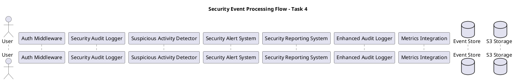

# Объяснение Sequence Diagram (security_flow_sequence.puml)

## Назначение диаграммы

Sequence Diagram (диаграмма последовательности) показывает временной поток взаимодействий между компонентами системы безопасности при обработке различных сценариев событий. Эта диаграмма помогает понять динамическое поведение системы и порядок выполнения операций.

## Структура PlantUML файла

### Заголовок и участники


**Объяснение участников:**
- **User** - инициатор всех событий безопасности
- **Auth Middleware** - промежуточное ПО для аутентификации
- **Logger** - центральный логгер событий безопасности
- **Detector** - детектор подозрительной активности
- **Alerts** - система оповещений и блокировки
- **Reports** - система генерации отчетов
- **Enhanced** - расширенный логгер для S3
- **Metrics** - интеграция с системой метрик
- **Store** - хранилище событий безопасности
- **S3** - S3-совместимое хранилище данных

## Основные сценарии взаимодействия

### 1. Сценарий попытки аутентификации
```plantuml
== Authentication Attempt ==
User -> Auth: Login request
Auth -> Logger: LogSecurityEvent(AUTH_ATTEMPT)
Logger -> Store: Store event
Logger -> Detector: Send event for analysis
```

**Детальное объяснение потока:**

1. **User → Auth: Login request**
   - Пользователь отправляет запрос на аутентификацию
   - Может включать username/password, токены, сертификаты
   - Инициирует цепочку событий безопасности

2. **Auth → Logger: LogSecurityEvent(AUTH_ATTEMPT)**
   - Middleware немедленно логирует попытку аутентификации
   - Создается событие типа `EventTypeAuthAttempt`
   - Включает метаданные: IP адрес, User-Agent, timestamp

3. **Logger → Store: Store event**
   - Событие сохраняется в хранилище для дальнейшего анализа
   - Используется двухуровневое хранение (память + диск)
   - Обновляются индексы для быстрого поиска

4. **Logger → Detector: Send event for analysis**
   - Событие асинхронно отправляется детектору
   - Не блокирует основной поток аутентификации
   - Запускает анализ паттернов в реальном времени

**Временные характеристики:**
- Общее время обработки: < 10мс
- Логирование: < 1мс
- Сохранение в Store: < 5мс
- Отправка в Detector: асинхронно

### 2. Сценарий обнаружения паттернов
```plantuml
== Pattern Detection ==
Detector -> Store: Query recent events
Detector -> Detector: Analyze patterns
alt Suspicious pattern detected
    Detector -> Alerts: TriggerAlert(BRUTE_FORCE)
    Alerts -> Store: Log alert event
    Alerts -> User: Block user (if threshold exceeded)
    Alerts -> Metrics: Update security metrics
end
```

**Детальное объяснение анализа:**

1. **Detector → Store: Query recent events**
   - Детектор запрашивает недавние события для анализа
   - Использует временное окно (например, последние 15 минут)
   - Фильтрует по типу события и пользователю/IP

2. **Detector → Detector: Analyze patterns**
   - Внутренний анализ паттернов поведения
   - Алгоритмы обнаружения:
     - **Брутфорс атаки** - множественные неудачные попытки
     - **Распределенные атаки** - атаки с разных IP
     - **Перебор аккаунтов** - попытки входа в разные аккаунты
     - **Временные аномалии** - необычное время доступа

3. **Условное выполнение при обнаружении угрозы:**

   a. **Detector → Alerts: TriggerAlert(BRUTE_FORCE)**
      - Создается оповещение о брутфорс атаке
      - Указывается тип угрозы и уровень серьезности
      - Включаются детали обнаруженного паттерна

   b. **Alerts → Store: Log alert event**
      - Само оповещение логируется как событие безопасности
      - Создается аудиторский след для расследования
      - Связывается с исходными событиями

   c. **Alerts → User: Block user (if threshold exceeded)**
      - При превышении порога пользователь блокируется
      - Применяется прогрессивная блокировка
      - Отправляется уведомление о блокировке

   d. **Alerts → Metrics: Update security metrics**
      - Обновляются метрики безопасности
      - Увеличиваются счетчики угроз
      - Данные отправляются в систему мониторинга

**Алгоритмы обнаружения:**
```go
// Пример алгоритма обнаружения брутфорса
func (d *Detector) detectBruteForce(userID string) bool {
    events := d.getRecentFailures(userID, 15*time.Minute)
    return len(events) >= d.config.BruteForceThreshold
}
```

### 3. Сценарий успешной аутентификации
```plantuml
== Successful Authentication ==
Auth -> Logger: LogSecurityEvent(AUTH_SUCCESS)
Logger -> Enhanced: LogEnhancedEvent(with metadata)
Enhanced -> S3: Write enhanced audit log
Logger -> Metrics: Update auth success metrics
```

**Детальное объяснение успешного входа:**

1. **Auth → Logger: LogSecurityEvent(AUTH_SUCCESS)**
   - Логируется успешная аутентификация
   - Создается событие типа `EventTypeAuthSuccess`
   - Включает информацию о методе аутентификации, MFA статусе

2. **Logger → Enhanced: LogEnhancedEvent(with metadata)**
   - Событие обогащается дополнительными метаданными
   - Добавляется информация о сессии, ролях, разрешениях
   - Включаются данные о геолокации и устройстве

3. **Enhanced → S3: Write enhanced audit log**
   - Расширенный лог записывается в S3 хранилище
   - Интегрируется с существующим S3 логированием
   - Обеспечивает долгосрочное хранение для аудита

4. **Logger → Metrics: Update auth success metrics**
   - Обновляются метрики успешных аутентификаций
   - Данные отправляются в Prometheus/Grafana
   - Обновляются дашборды безопасности

**Метаданные успешной аутентификации:**
```json
{
  "event_type": "auth_success",
  "user_id": "user123",
  "session_id": "sess_abc123",
  "mfa_used": true,
  "auth_method": "password+totp",
  "ip_address": "192.168.1.100",
  "geo_location": "New York, US",
  "device_fingerprint": "fp_xyz789",
  "risk_score": 15
}
```

### 4. Сценарий неудачной аутентификации
```plantuml
== Failed Authentication ==
Auth -> Logger: LogSecurityEvent(AUTH_FAILURE)
Logger -> Detector: Increment failure count
Detector -> Detector: Check failure thresholds
alt Threshold exceeded
    Detector -> Alerts: TriggerAlert(MULTIPLE_FAILURES)
    Alerts -> Logger: LogSecurityEvent(USER_LOCKED)
end
```

**Детальное объяснение неудачного входа:**

1. **Auth → Logger: LogSecurityEvent(AUTH_FAILURE)**
   - Логируется неудачная попытка аутентификации
   - Включается причина неудачи (неверный пароль, заблокированный аккаунт)
   - Сохраняются детали для анализа

2. **Logger → Detector: Increment failure count**
   - Увеличивается счетчик неудачных попыток для пользователя/IP
   - Обновляется временное окно анализа
   - Сохраняется история попыток

3. **Detector → Detector: Check failure thresholds**
   - Проверяются настроенные пороги безопасности
   - Анализируется частота неудачных попыток
   - Оценивается риск продолжающейся атаки

4. **Условное выполнение при превышении порога:**

   a. **Detector → Alerts: TriggerAlert(MULTIPLE_FAILURES)**
      - Создается оповещение о множественных неудачах
      - Указывается количество попыток и временной интервал
      - Рекомендуются действия по реагированию

   b. **Alerts → Logger: LogSecurityEvent(USER_LOCKED)**
      - Логируется событие блокировки пользователя
      - Указывается причина и продолжительность блокировки
      - Создается аудиторский след

**Пороги блокировки:**
```go
type SecurityThresholds struct {
    MaxFailedAttemptsPerUser   int           // 5 попыток
    MaxFailedAttemptsPerIP     int           // 20 попыток
    FailureTimeWindow          time.Duration // 15 минут
    UserLockoutDuration        time.Duration // 15 минут
    ProgressiveLockoutEnabled  bool          // true
}
```

### 5. Сценарий мониторинга доступа к S3
```plantuml
== S3 Access Monitoring ==
User -> S3: S3 API request
S3 -> Enhanced: Generate access log
Enhanced -> Logger: Extract security events
Logger -> Store: Store S3 security events
Logger -> Detector: Analyze access patterns
```

**Детальное объяснение мониторинга S3:**

1. **User → S3: S3 API request**
   - Пользователь выполняет операцию с S3 (GET, PUT, DELETE)
   - Запрос проходит через аутентификацию и авторизацию
   - Генерируется стандартный S3 access log

2. **S3 → Enhanced: Generate access log**
   - S3 сервис генерирует расширенный лог доступа
   - Включаются дополнительные поля безопасности
   - Интегрируется с существующим логированием

3. **Enhanced → Logger: Extract security events**
   - Из S3 логов извлекаются события безопасности
   - Создаются структурированные события для анализа
   - Обогащаются метаданными аутентификации

4. **Logger → Store: Store S3 security events**
   - События сохраняются в центральном хранилище
   - Индексируются для быстрого поиска
   - Связываются с событиями аутентификации

5. **Logger → Detector: Analyze access patterns**
   - Запускается анализ паттернов доступа к данным
   - Выявляются аномальные операции
   - Обнаруживаются попытки несанкционированного доступа

**Типы S3 событий безопасности:**
- Доступ к конфиденциальным данным
- Массовые операции скачивания
- Необычные паттерны доступа
- Операции в нерабочее время
- Доступ с новых IP адресов

### 6. Сценарий генерации отчетов
```plantuml
== Security Reporting ==
Reports -> Store: Query security events
Reports -> Reports: Generate report
Reports -> Reports: Export to format (JSON/CSV/HTML)
alt Automated report
    Reports -> Alerts: Schedule next report
end
```

**Детальное объяснение отчетности:**

1. **Reports → Store: Query security events**
   - Система отчетов запрашивает события за определенный период
   - Применяются фильтры по типу событий, пользователям, серьезности
   - Используются оптимизированные запросы с индексами

2. **Reports → Reports: Generate report**
   - Агрегируются данные для различных типов отчетов:
     - **Access Summary** - сводка по доступу
     - **Authentication Log** - детальные логи аутентификации
     - **Security Alerts** - отчеты по оповещениям
     - **Audit Trail** - полный аудиторский след
     - **Compliance Report** - отчеты соответствия

3. **Reports → Reports: Export to format**
   - Отчеты экспортируются в различные форматы:
     - **JSON** - для программной обработки
     - **CSV** - для анализа в Excel
     - **HTML** - для веб-просмотра
     - **PDF** - для официальных документов

4. **Условное выполнение для автоматических отчетов:**
   - **Reports → Alerts: Schedule next report**
     - Планируется следующий автоматический отчет
     - Настраивается периодичность генерации
     - Отправляются уведомления о готовности отчета

**Типы отчетов:**
```go
const (
    ReportTypeAccessSummary      ReportType = "access_summary"
    ReportTypeAuthenticationLog  ReportType = "authentication_log"
    ReportTypeSecurityAlerts     ReportType = "security_alerts"
    ReportTypeUserActivity       ReportType = "user_activity"
    ReportTypeAuditTrail         ReportType = "audit_trail"
    ReportTypeComplianceReport   ReportType = "compliance_report"
    ReportTypeRiskAssessment     ReportType = "risk_assessment"
    ReportTypeIncidentReport     ReportType = "incident_report"
)
```

### 7. Сценарий сбора метрик
```plantuml
== Metrics Collection ==
loop Every metrics interval
    Metrics -> Store: Collect security metrics
    Metrics -> Metrics: Aggregate data
    Metrics -> "External Metrics": Send metrics
end
```

**Детальное объяснение сбора метрик:**

1. **Периодический цикл сбора:**
   - Выполняется каждые 5 минут (настраивается)
   - Использует горутину для неблокирующего выполнения
   - Обрабатывает ошибки и восстанавливается после сбоев

2. **Metrics → Store: Collect security metrics**
   - Запрашиваются агрегированные данные из хранилища
   - Подсчитываются события за последний интервал
   - Вычисляются статистические показатели

3. **Metrics → Metrics: Aggregate data**
   - Агрегируются различные типы метрик:
     - Количество событий аутентификации
     - Частота использования MFA
     - Количество заблокированных пользователей
     - Средняя оценка риска
     - Географическое распределение

4. **Metrics → External Metrics: Send metrics**
   - Метрики отправляются в Prometheus
   - Обновляются Grafana дашборды
   - Настраиваются алерты на основе метрик

**Примеры метрик:**
```go
type SecurityMetrics struct {
    AuthenticationAttempts    int64   `json:"authentication_attempts"`
    AuthenticationSuccesses   int64   `json:"authentication_successes"`
    AuthenticationFailures    int64   `json:"authentication_failures"`
    MFAUsageCount            int64   `json:"mfa_usage_count"`
    SuspiciousActivityCount   int64   `json:"suspicious_activity_count"`
    AccountLockouts          int64   `json:"account_lockouts"`
    AverageRiskScore         float64 `json:"average_risk_score"`
    UniqueUsers              int64   `json:"unique_users"`
    UniqueIPs                int64   `json:"unique_ips"`
}
```

## Временные характеристики системы

### Производительность операций
- **Логирование события:** < 1мс
- **Сохранение в хранилище:** < 5мс
- **Анализ паттернов:** < 100мс
- **Генерация оповещения:** < 50мс
- **Блокировка пользователя:** < 10мс

### Пропускная способность
- **События в секунду:** > 1000
- **Concurrent пользователи:** > 10000
- **Размер хранилища:** до 1TB событий
- **Время хранения:** 1 год (настраивается)

## Обработка ошибок и восстановление

### Стратегии отказоустойчивости
1. **Graceful degradation** - система продолжает работать при частичных сбоях
2. **Circuit breaker** - предотвращение каскадных сбоев
3. **Retry mechanisms** - автоматические повторы при временных сбоях
4. **Fallback options** - альтернативные пути выполнения

### Мониторинг здоровья системы
```plantuml
note over Logger, Detector
  All components work together to provide:
  - Real-time threat detection
  - Automated response to attacks
  - Comprehensive audit trails
  - Security metrics and reporting
end note
```

## Преимущества архитектуры последовательности

### 1. Асинхронная обработка
- Неблокирующие операции для критического пути
- Высокая производительность аутентификации
- Масштабируемость под нагрузкой

### 2. Реальное время
- Немедленное обнаружение угроз
- Быстрое реагирование на атаки
- Минимальная задержка блокировки

### 3. Комплексность
- Полное покрытие событий безопасности
- Интеграция всех компонентов системы
- Единый поток обработки данных

### 4. Наблюдаемость
- Детальное логирование всех операций
- Метрики для мониторинга производительности
- Аудиторские следы для расследований

## Соответствие требованиям Task 4

### 4.1 Улучшение аудит логирования
- Структурированное логирование всех событий
- Расширенные метаданные для S3 доступа
- Централизованное хранение и индексирование

### 4.2 Система оповещений и блокировки
- Реальное время обнаружения угроз
- Автоматическая блокировка при превышении порогов
- Интеграция с системой метрик и мониторинга

### 4.3 Система отчетности и аудиторского следа
- Генерация различных типов отчетов
- Экспорт в множественные форматы
- Полный аудиторский след всех операций

Sequence Diagram обеспечивает понимание динамического поведения системы и помогает в оптимизации производительности и надежности.